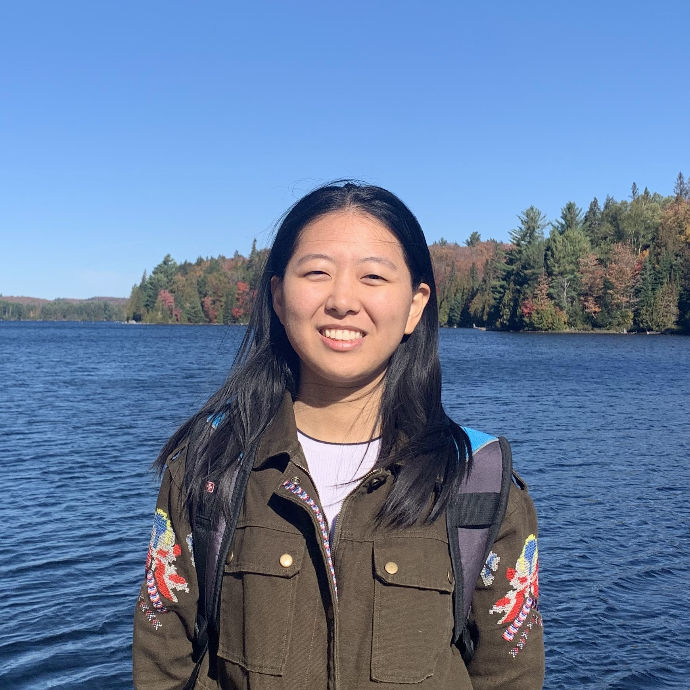
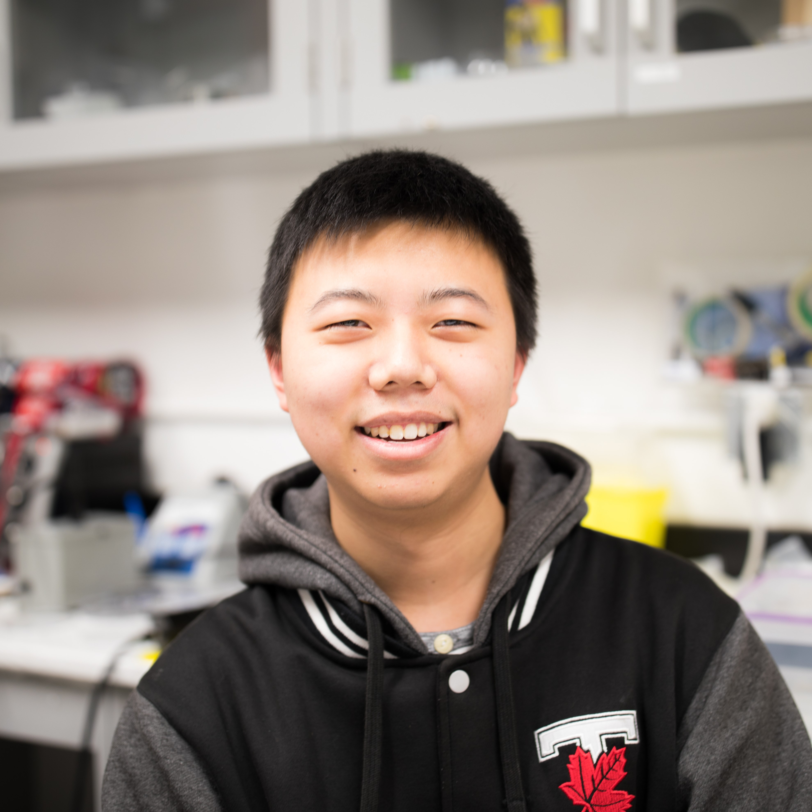

# Hongyu (Charlie) Chen

### Embedded Software Engineer (Processing and Control)
Hongyu is an Engineering Science student majoring in [Machine Intelligence](https://engsci.utoronto.ca/explore_our_program/majors/machine-intelligence/). As the embedded software engineer for the team, she is in charge of developing the embedded software for the robotic system. Hongyu implemented algorithms for robot operation as well as keypad and display interface for the system in C. She also accomplished extra design features such as real-time date/time display, permanent operation logs and PC interface. 

# Ryan Chen

### Electrical Engineer (Instrumentation and Interfacing)
Ryan is an Engineering Science student majoring in [Robotics Engineering](https://engsci.utoronto.ca/explore_our_program/majors/roboticsengineeringoption/). As the electrical engineer for the team, he is responsible for constructing the digital and analog interfacing electronics to connect the sensors and actuators to the microcontroller board. He also designed and constructed the power distribution and motor driver circuits for the robot. Furthermore, Ryan calibrated the input/output signals from all of the sensors embedded in the robot. 

# Yutong (Irina) Zhu

### Mechanical Engineer (Mechanism and Actuation)
Yutong is an Engineering Science student majoring in [Biomedical Systems Engineering](https://engsci.utoronto.ca/explore_our_program/majors/biomedical/). As the mechanical engineer for the team, she is responsible for constructing the platform, structure, frames, and incorporating actuators and mechanisms required in the robotic system. In addition to the design and fabrication of these mechanical components, she also assigned the locations of the sensors and circuit boards to produce an optimally compact robot. 
